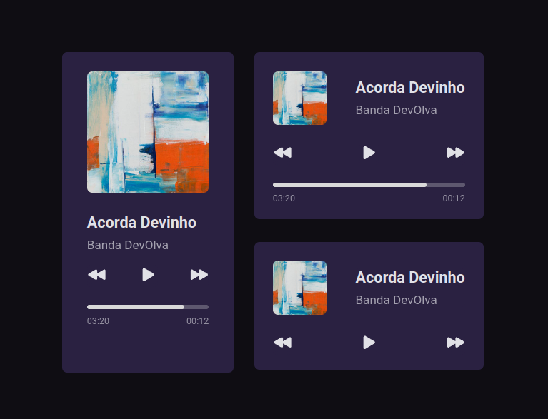
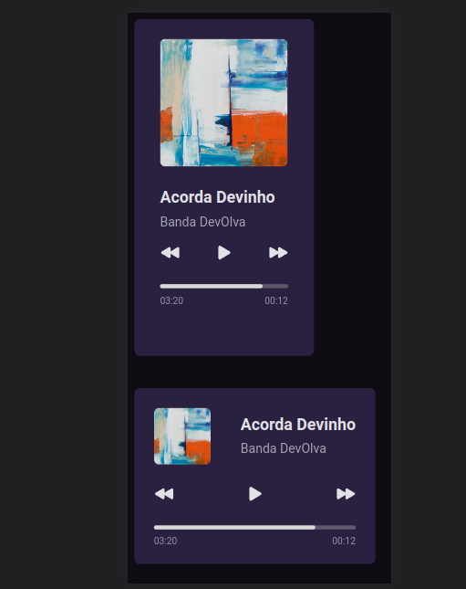

# Player de Musica

Layout desenvolvido durante o desafio #01 do #boracodar da RocketSeat.

### Adicionais:
- [x] Reactjs.
- [x] React functional components.
- [x] Styled components.

### Desktop (screenshot):

### Mobile (screenshot):

### Dê uma olhada como o projeto ficou!

https://playermusic-gilt.vercel.app
 
